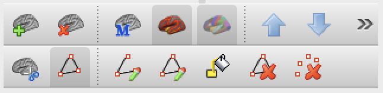

# Drawing Retinotopic Regions of Interest (ROIs) on Freesurfer Surface <!-- omit in toc -->

Please contact Rania Ezzo (rania.ezzo@nyu.edu) for any questions or suggestions.
Date: Jan 24, 2025

## Table of Contents <!-- omit in toc -->
- [Software Requirements](#software-requirements)
- [Background \& Description](#background--description)
- [First Time Set up only](#first-time-set-up-only)
- [Repeated set up for drawing](#repeated-set-up-for-drawing)

# Software Requirements
This tutorial requires [Freesurfer](https://surfer.nmr.mgh.harvard.edu/fswiki/DownloadAndInstall) to be installed. These instructions assume that Freesurfer recon-all has bee run for the subject’s anatomical scan, and population receptive fields (pRFs) have already been modeled and the polar angle/eccentricity estimates are in Freesurfer surface space. For more information about how to run pRF fits, see [prfVista](https://github.com/WinawerLab/prfVista), or [analyzePRF](https://github.com/cvnlab/analyzePRF).


# Background & Description
This document outlines how to draw regions of interest (ROIs) in the visual cortex, including regions V1, V2, V3, hV4, V3A/B, MT, and MST. For a deeper background on retinotopic organization of the visual cortex please refer to the following:

- Wandell, Dumoulin & Brewer 2007. Visual field maps in human cortex (Figs 5-6)
- Wandell & Winawer 2011. Imaging retinotopic maps in the human brain (Figs 4-5)
- Barton & Brewer 2017. Visual Field Map Clusters in High-Order Visual Processing: Or- ganization of V3A/V3B and a New Cloverleaf Cluster in the Posterior Superior Temporal Sulcus (Figs 2)
- Benson et al. 2022. Variaility of the surface area of the V1, V2, and V3 maps in a large sample of human observers
- Witthoft et al. 2014. Where is human V4? Predicting the location of hV4 and VO1 from cortical folding
- Winawer & Witthoft. 2015. Human V4 and ventral occipital retinotopic maps

# First Time Set up only

1. (Optional): Create a folder that includes an identifier of the drawer to save your manual labels

```bash
mkdir  $SUBJECTS_DIR/$SUBJECT_NAME/label/retinotopy_RE
```


2. Copy provided custom color maps to display polar angle and eccentricity gradients, or create your own. Note the eccentricity scale provided is linearly spaced.

```bash
cp eccentricity_color_scale $SUBJECTS_DIR/eccentricity_color_scale
cp angle_color_scale $SUBJECTS_DIR/angle_color_scale
```


# Repeated set up for drawing

1. In the terminal, change directory and set variables

```bash
cd /path/to/pRF/files/                              # path to where mgz files for eccentricity and polar maps are
SUBJECTS_DIR=/path/to/subject/recon-all/output      # path to where recon-all output is
SUBJECT_NAME=sub-<subjectname>                      # replace with name of subject folder within SUBJECTS_DIR
HEMI=rh                                             # for right hemisphere (change to lh for left)
```


2. Display the inflated surface in freeview with the eccentricity and polar angle maps overlayed.

```bash
freeview -f $SUBJECTS_DIR/$SUBJECT_NAME/surf/$HEMI.inflated:overlay=$HEMI.angle_adj.mgz:overlay_custom=$SUBJECTS_DIR/angle_corr_color_scale:overlay=$HEMI.eccen.mgz:overlay_custom=$SUBJECTS_DIR/eccentricity_color_scale
```


3. Position the inflated surface so that you can see the majority of the ROI you are planning to draw. Then click on 
    "Path Custom Fill," then "Make Path"
    


4. Make a path by clicking on parts of the cortex that are the outer boundary of the first region you are drawing, e.g. V1. Hold down on the “click” and drag to turn the surface while drawing the ROI.
    < insert image here>


5. After drawing, click on “Make Closed Path”. This will connect all the dots with one boundary line.


6. Next, click inside the middle of the the ROI. This should make a point within the boundary like this:


7. Then click “Custom Fill”

8. Once the ROI is created, save it to the folder with the naming scheme outlined below.

9. To create the next ROI, make sure you “Clear Marks/Clear paths etc.” in the toolbar. And then make a path for the next region in the hierarchy, e.g., V2d. Make the boundaries significantly overlap within the adjacent region so that the ROI will be created as adjacent.

10. Then put a marked point (see tiny cyan point inside the yellow boundary) inside the area to be filled. Then click “Custom Fill” with these options. 

11. Save out the manual ROIS [**label name and file name are the same**]. Save inside the folder you created with your initials. Name the ROIs as follows, where XX is your initials and ? is r or l:

12. Repeat the above steps for the other hemisphere.

