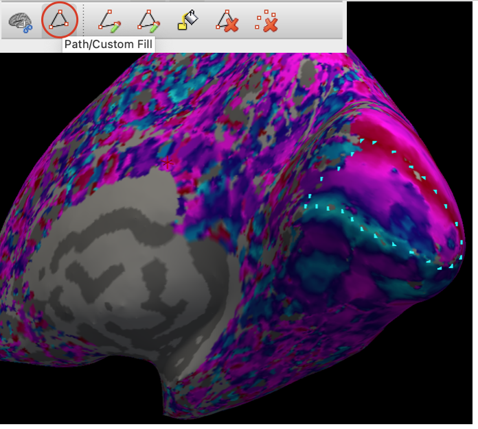
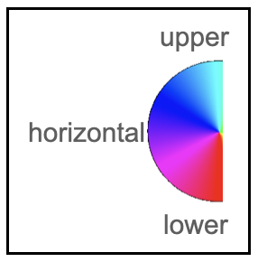
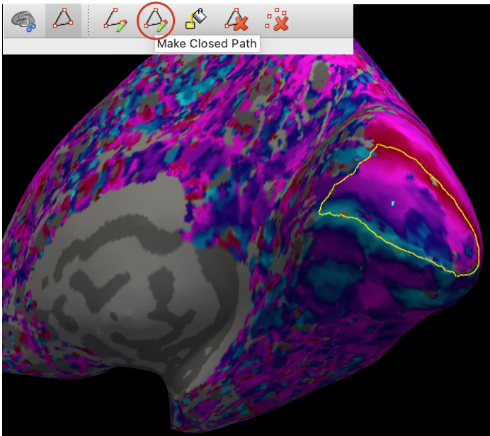
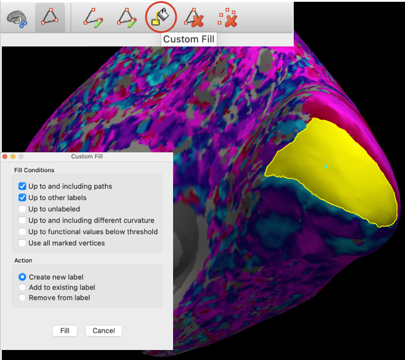
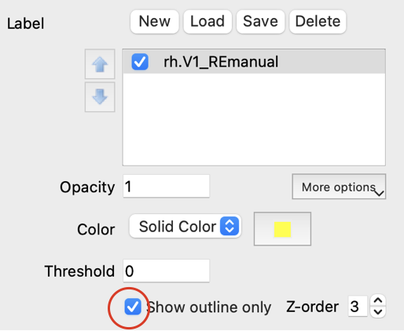
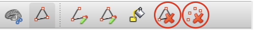
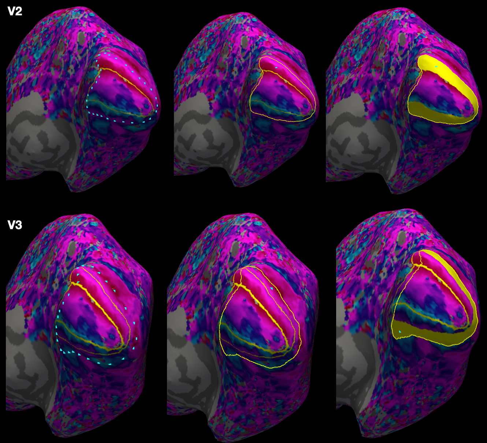

# Drawing Retinotopic Regions of Interest (ROIs) on Freesurfer Surface <!-- omit in toc -->

Please contact Rania Ezzo (rania.ezzo@nyu.edu) for any questions or suggestions.
Date: Jan 24, 2025

## Table of Contents <!-- omit in toc -->
- [Software Requirements](#software-requirements)
- [Background \& Description](#background--description)
- [First Time Set up only](#first-time-set-up-only)
- [Repeated set up for drawing](#repeated-set-up-for-drawing)

# Software Requirements
This tutorial requires [Freesurfer](https://surfer.nmr.mgh.harvard.edu/fswiki/DownloadAndInstall) to be installed. These instructions assume that Freesurfer recon-all has been run for the subject’s anatomical scan, and population receptive fields (pRFs) have already been modeled and the polar angle/eccentricity estimates are in Freesurfer surface space. For more information about how to run pRF fits, see [prfVista](https://github.com/WinawerLab/prfVista), or [analyzePRF](https://github.com/cvnlab/analyzePRF).


# Background & Description
This document outlines how to draw regions of interest (ROIs) V1-V3 in the visual cortex. For a deeper background on retinotopic organization of V1-V3 please refer to the following:

- Wandell, Dumoulin & Brewer 2007. Visual field maps in human cortex (Figs 5-6)
- Wandell & Winawer 2011. Imaging retinotopic maps in the human brain (Figs 4-5)
- Benson et al. 2022. Variaility of the surface area of the V1, V2, and V3 maps in a large sample of human observers

# First Time Set up only

1. (Optional): Create a folder that includes an identifier of the drawer to save your manual labels

```bash
mkdir  $SUBJECTS_DIR/$SUBJECT_NAME/label/retinotopy_RE
```


2. Copy provided custom color maps to display polar angle and eccentricity gradients, or create your own. Note the eccentricity scale provided is linearly spaced.

```bash
cp eccentricity_color_scale $SUBJECTS_DIR/eccentricity_color_scale
cp angle_color_scale $SUBJECTS_DIR/angle_color_scale
```


# Repeated set up for drawing

1. In the terminal, change directory and set variables

```bash
cd /path/to/pRF/files/                              # path to where mgz files for eccentricity and polar maps are
SUBJECTS_DIR=/path/to/subject/recon-all/output      # path to where recon-all output is
SUBJECT_NAME=sub-<subjectname>                      # replace with name of subject folder within SUBJECTS_DIR
HEMI=rh                                             # for right hemisphere (change to lh for left)
```


2. Display the inflated surface in freeview with the eccentricity and polar angle maps overlayed.

```bash
freeview -f $SUBJECTS_DIR/$SUBJECT_NAME/surf/$HEMI.inflated:overlay=$HEMI.angle_adj.mgz:overlay_custom=$SUBJECTS_DIR/angle_corr_color_scale:overlay=$HEMI.eccen.mgz:overlay_custom=$SUBJECTS_DIR/eccentricity_color_scale
```


3. Position the inflated surface so that you can see the majority of the ROI you are planning to draw. Then click on "Path Custom Fill," then add points by clicking along the polar angle reversals from lowe to upper vertical meridian.

    
    


4. After drawing, click on “Make Closed Path”. This will connect all the dots with one boundary line. After this, click inside the middle of the the ROI. This should make a point within the boundary like this:
   


5. Then click “Custom Fill” to create the label 

    


6. Once the ROI is created, rename the label and save it to the folder with your initials. Click on the Show outline only check box.

    

7.  To create the next ROI, make sure you “Clear Marks/Clear paths etc.” in the toolbar. Recommended to save as a name like this <hemi>.<ROIname>_<your_intials>. Keep naming scheme consistent across all ROIs drawn.
    


8.  And then make a path for the adjacent region (e.g., V2) using the steps above. NOTE: make the boundaries significantly overlap with the already-drawn ROI (V1). This will ultimately result in touching boundaries. Make sure to save when done.
   
   

9.  Repeat the above steps for the other hemisphere.

