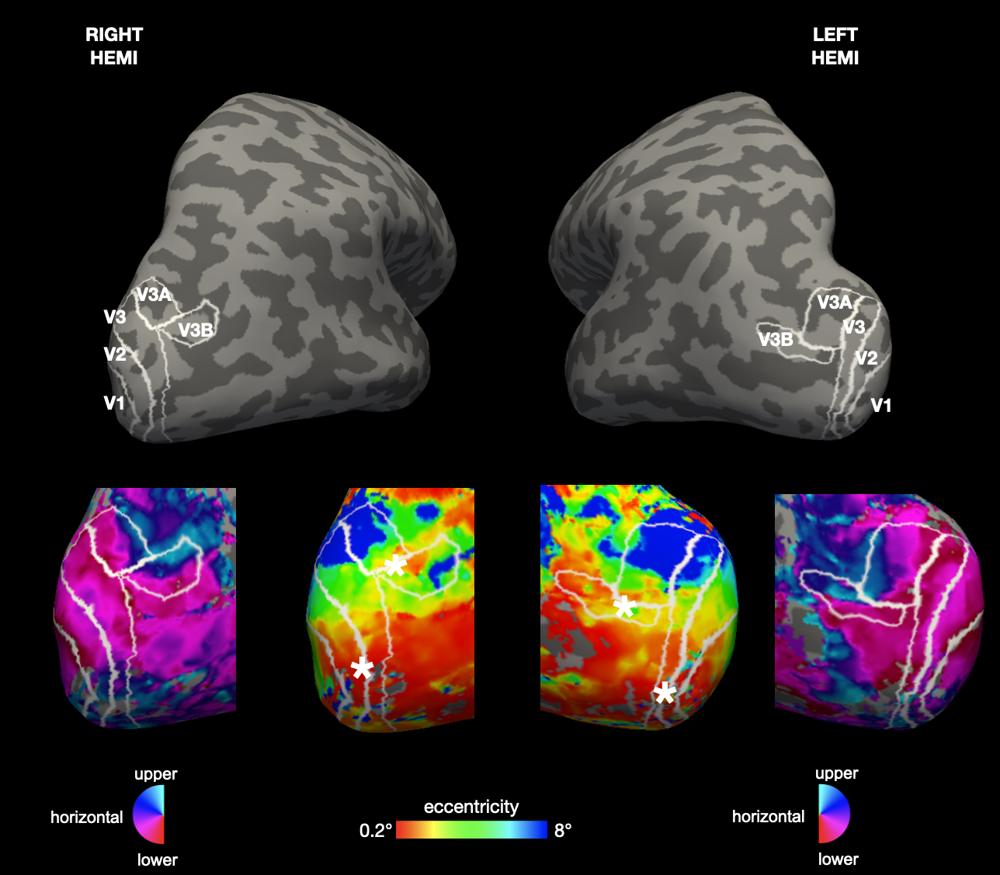
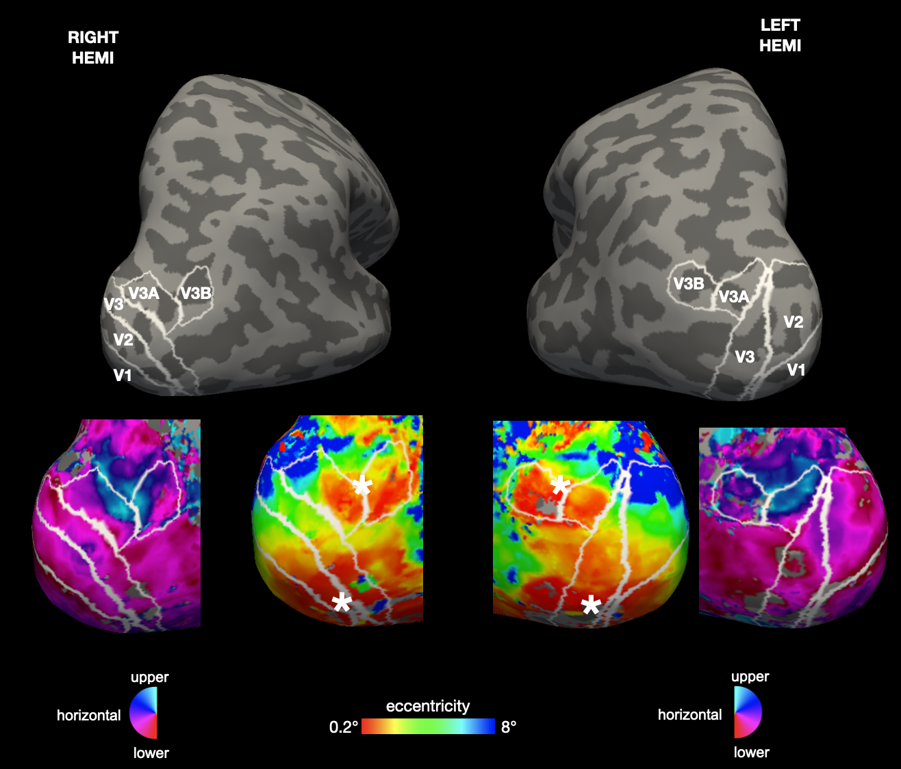
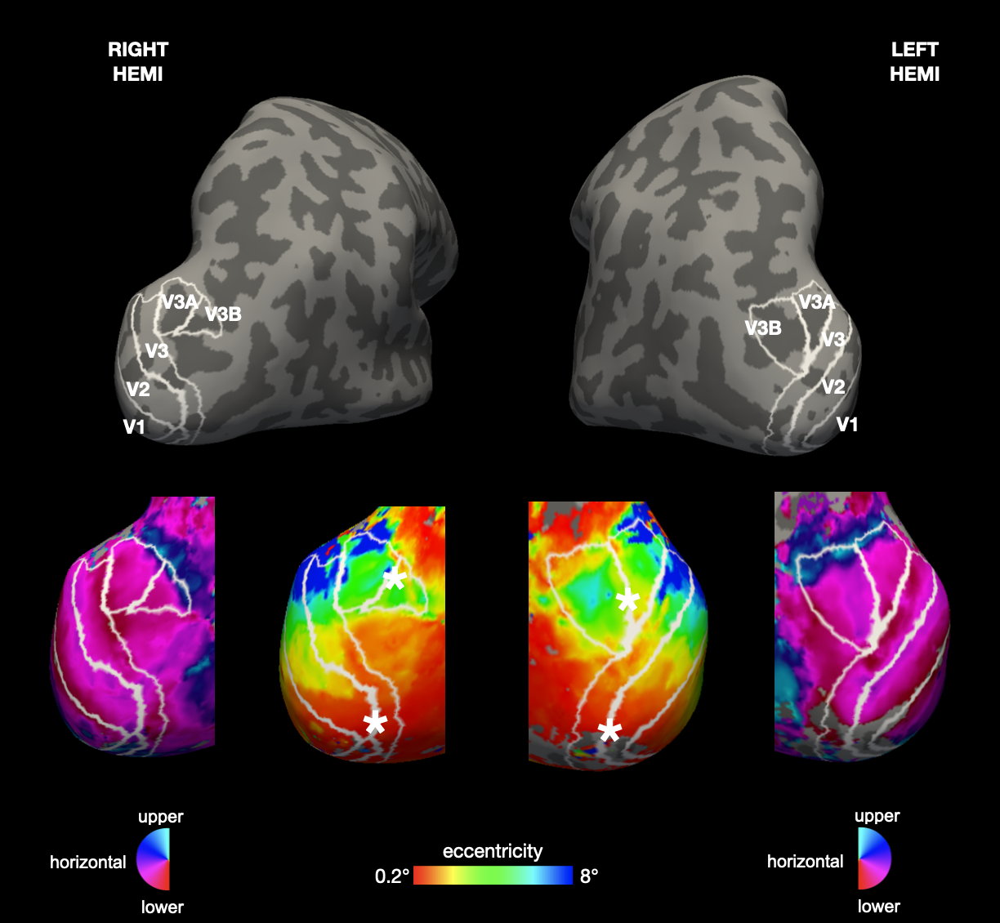
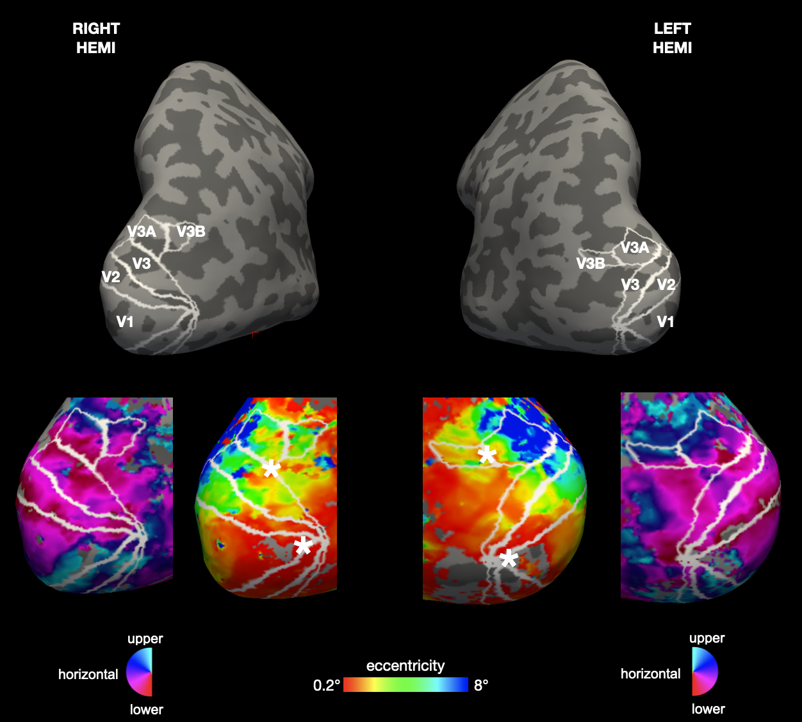

# Example Regions of Interest (V3a-b) on Freesurfer Surface <!-- omit in toc -->

Please contact Rania Ezzo (rania.ezzo@nyu.edu) for any questions or suggestions.
Date: Jan 24, 2025

## Table of Contents <!-- omit in toc -->
- [Software Requirements](#software-requirements)
- [Background \& Description](#background--description)
- [Tips for Drawing V3a and V3b](#tips-for-drawing-v3a-and-v3b)
- [Examples](#examples)

# Software Requirements
Same software requirements as outlined in drawingSurfaceRetROISV1-V3. Here we assume that V1-V3 have already been drawn, manual ROI folder is created, and colormaps are copied to Freesurfer folder.

# Background & Description
This document outlines how to draw regions of interest (ROIs) V3a-b in the visual cortex. For a deeper background on retinotopic organization of V1-V3 please refer to the following. Keep in mind that some figures in these papers display ROIs on flattened surface, which appear different from the inflated surface:

- Barton & Brewer 2017. Visual Field Map Clusters in High-Order Visual Processing: Or- ganization of V3A/V3B and a New Cloverleaf Cluster in the Posterior Superior Temporal Sulcus (Fig 2)
- Swisher, Halko, Merabet, McMains & Somers. 2007. Visual Topography of Human Intraparietal Sulcus.
- Wandell, Dumoulin & Brewer 2007. Visual field maps in human cortex (Figs 5-6)
- Wandell & Winawer 2011. Imaging retinotopic maps in the human brain (Figs 4-5)

# Tips for Drawing V3a and V3b
- V3a is adjacent to dorsal V3 (more peripheral eccentricities ~ 4-10) and covers an entire hemifield (from lower to upper visual field meridian)
- V3b is adjacent to V3a and usually extends laterally (does not always touch V3).
- V3a and V3b usually have central eccentricities at their boundary.

# Examples
   

   

   

   

   

