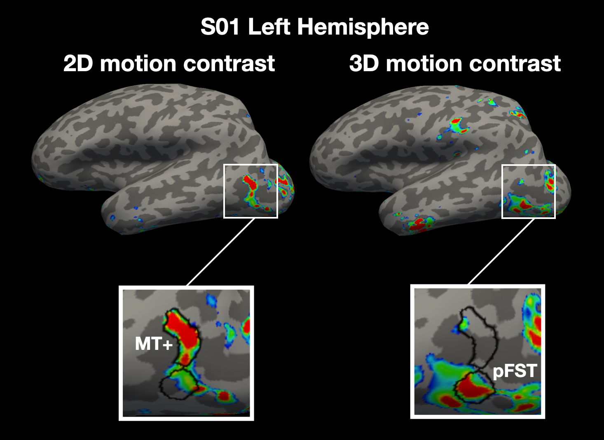
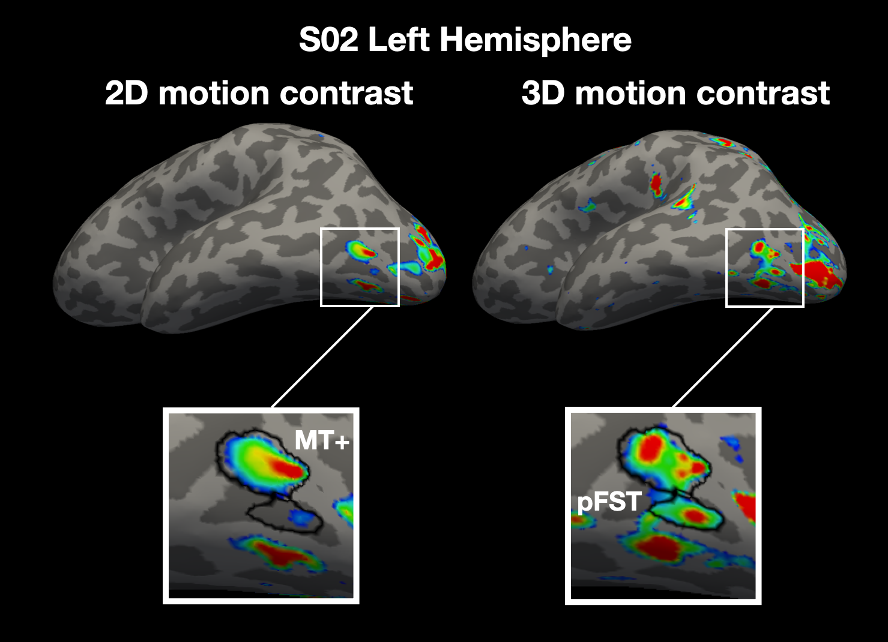

# Example Regions of Interest (putative FST) on Freesurfer Surface <!-- omit in toc -->

Please contact Rania Ezzo (rania.ezzo@nyu.edu) or Puti Wen (pw1246@nyu.edu) for any questions or suggestions.
Date: Feb 7, 2025

## Table of Contents <!-- omit in toc -->
- [Requirements](#requirements)
- [Background \& Description](#background--description)
- [Tips for Drawing MT+ and FST](#tips-for-drawing-mt-and-fst)
- [Set up and steps for drawing](#set-up-and-steps-for-drawing)
- [Example subject with MT+ and pFST with little to no overlap in 2D vs. 3D activation:](#example-subject-with-mt-and-pfst-with-little-to-no-overlap-in-2d-vs-3d-activation)
- [Example subject with MT+ and pFST with overlap in 2D vs. 3D activation:](#example-subject-with-mt-and-pfst-with-overlap-in-2d-vs-3d-activation)

# Requirements
Same software requirements as outlined in drawingSurfaceRetROISV1-V3. Here we assume that manual ROI folder is created, and 2D motion localizer data were obtained for MT+ (static vs. moving dots) and 3D motion localizer data for FST (e.g., dots with temporally coherent changing disparity vs. dots with temporally scrambled disparity). When refering to 2D and 3D motion below, we are referring to contrast maps for the 2D and 3D motion responses by running GLMs for each protocol- for the 2D this would be moving dots - static control; for the 3D this would be temporally coherent changing disparity - temporally scrambled control. Please refer to manuscript for more details about the stimuli. 


# Background & Description
This document outlines how to draw the regions of interest (ROI) for putative FST based on functional localization. Prior work using a 2D motion localizer to localize MT+:
- Huk AC, Dougherty RF, Heeger DJ. 2002. Retinotopy and functional subdivision of human areas MT and MST.
- Tootell RB, Reppas JB, Dale AM, Look RB, Sereno MI, Malach R, Brady TJ, Rosen BR. 1995. Visual motion aftereffect in human cortical area MT revealed by functional magnetic resonance imaging.


Support for FST's role in processing 3D motion is included below: 
- FST: Héjja-Brichard Y, Rima S, Rapha E, Durand J-B, Cottereau BR. 2020. Stereomotion processing in the nonhuman primate brain. (monkey neuroimaging study)
- FST: Thompson LW, Kim B, Rokers B, Rosenberg A. 2023. Hierarchical computation of 3D motion across macaque areas MT and FST. (monkey electrophysiology study)
- 3D responsive area ventral to MT/MST: Likova LT, Tyler CW. 2007. Stereomotion processing in the human occipital cortex. (human neuroimaging study)
- FST: Functional localization of visual motion area FST in humans. (under review). Wen, Ezzo, Thompson, Rosenberg, Landy & Rokers. (human neuroimaging study)


# Tips for Drawing MT+ and FST
- View each of the contrast (2D and 3D motion) on the inflated surface to prepare for drawing
-  MT+ is drawn first because this method is better established. We use a prior that pFST is located ventral/anterior to MT+, so this is the region to look for 3D activity.
- There are two typical profiles across observers: (1) 2D and 3D motion activation appear as separate blobs (no overlap), and (2) 3D motion activates both MT+ and additional cortex. In this latter case, there is overlap but we use MT+ to guide which vertices are excluded when drawing FST.
- The boundaries are drawn conservatively, so the ROI size may be underestimated. We use the same thresholding for the 2D and 3D contrast maps, and it can be helpful to increase/decrease this threshold for some hemispheres.
- In cases where the 3D motion localizer results in multiple peak activations, our choice of FST location is based on the one adjacent or closer to the ventral/anterior boundary of MT+.
- Some subjects have a strip of 3D motion responses in the occipitotemporal sulcus (adjacent to fusiform gyrus). This is further from the expected location of FST, so we chose to omit this from our definition of pFST. In a few cases (e.g., LH sub-0255, RH sub-0426) we drew this as pFST without an alternative, which led to low confidence for pFST in these 2 hemispheres.

# Set up and steps for drawing

1. In the bash terminal, change directory and set variables

```bash
cd /path/to/contrastmaps/                          # path to where mgz files for eccentricity and polar maps are
SUBJECTS_DIR=/path/to/freesurfer/directory/         # path to where recon-all output is
SUBJECT_NAME=sub-<subjectname>                      # replace with name of subject folder within SUBJECTS_DIR
HEMI=rh                                             # for right hemisphere (change to lh for left)
```

2. We configure the values to show the voxel activity in the 95-99 percentile across the entire brain. We apply a smoothing kernel (5 steps), and find it helpful to use an inverse colorwheel. These settings can be applied directly with this command when displaying the surfaces. The threshold can be adjusted dynamically (in the GUI) to help deineate MT+ and FST.
```bash
freeview -f $SUBJECTS_DIR/$SUBJECT_NAME/surf/$HEMI.inflated:overlay=./<3DdataFolder>/$SUBJECT_NAME/$HEMI.3Dcoherent-scrambled.mgz:overlay_color=colorwheel,inverse:overlay_threshold=95,99,percentile:overlay_smooth=5:overlay=./<2DdataFolder>/$SUBJECT_NAME/$HEMI.2Dmotion-static.mgz:overlay_color=colorwheel,inverse:overlay_threshold=95,99,percentile:overlay_smooth=5
```


# Example subject with MT+ and pFST with little to no overlap in 2D vs. 3D activation:
   
Here there is clear functional separation. Note that the 3D motion localizer has multiple peaks and this is an example where our choice of pFST location is based on the one adjacent or closer to the ventral/anterior boundary of MT+.




# Example subject with MT+ and pFST with overlap in 2D vs. 3D activation:

Example of functional overlap, which is more difficult to draw. Here we assume that the 3D motion localizer elicits selective responses in both MT+ and pFST while the 2D motion localizer just in MT+. This hemisphere additionally has a strip of activity more ventral to where we located pFST- which in this case is activated by both localizers. We excluded this for reasons detailed in the guidelines above.
   


